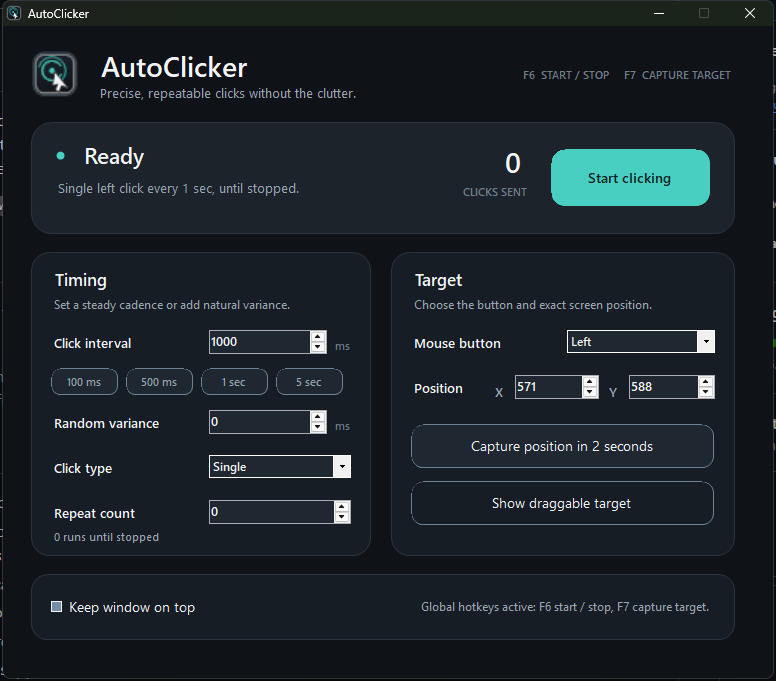

# AutoClicker: free auto clicker for Windows

AutoClicker is a free, portable auto clicker for Windows 10 and Windows 11. It automates left, right, or middle mouse clicks at a fixed screen position with adjustable intervals, optional random variance, repeat counts, single or double clicks, and global keyboard hotkeys.

The app runs as a single Windows executable. It has no installer, accounts, ads, telemetry, or network access. The complete C# and WinForms source code is available in this repository.

[](https://github.com/TheChrisCross/AutoClicker/releases/latest)
[](Program.cs)
[](https://dotnet.microsoft.com/)
[](https://github.com/TheChrisCross/AutoClicker/releases/latest)



## Download AutoClicker for Windows

**[Download AutoClicker.exe](https://github.com/TheChrisCross/AutoClicker/releases/latest/download/AutoClicker.exe)** from the latest published release. AutoClicker is portable, so you can place the executable in any folder and run it without installation.

Windows SmartScreen may show a warning on first launch because the executable is not code-signed. Choose **More info > Run anyway**, or review the source and build the executable locally.

The source on the `main` branch may be newer than the latest packaged release.

## Auto clicker features

- Adjustable click interval from 10 milliseconds to 10 minutes
- Quick presets for 100 ms, 500 ms, 1 second, and 5 seconds
- Optional random timing variance for less uniform click timing
- Left, right, and middle mouse button automation
- Single-click and double-click modes
- Unlimited clicking or a fixed repeat count
- Exact X and Y target coordinates across multiple monitors
- Two-second cursor-position capture
- Draggable target marker for visual position selection
- Global `F6` hotkey to start or stop clicking
- Global `F7` hotkey to capture the current cursor position
- `Escape` emergency stop while the AutoClicker window is focused
- Live click counter, run status, and finite-run progress
- Always-on-top option
- No accounts, telemetry, ads, or network requests

## How to use the auto clicker

1. Run `AutoClicker.exe`.
2. Set the click interval and optional random variance.
3. Choose single or double click, the mouse button, and a repeat count. Use `0` to click until stopped.
4. Choose the target position:
   - Place the cursor over the target and press `F7`.
   - Select **Capture position in 2 seconds**, then move the cursor.
   - Enter the X and Y coordinates directly.
   - Select **Show draggable target** and move the crosshair.
5. Press `F6` or select **Start clicking**.
6. Press `F6`, select **Stop clicking**, or press `Escape` while the app is focused to stop.

AutoClicker locks its settings during a run so the click interval and target cannot change accidentally. The draggable marker hides before automated clicking begins.

## Frequently asked questions

### What is an auto clicker?

An auto clicker is a desktop utility that sends repeated mouse clicks automatically. It is useful for repetitive computer tasks, software testing, accessibility workflows, and applications that require repeated input.

### Is AutoClicker free?

Yes. The Windows executable and the complete source code are available from this GitHub repository at no charge.

### Does AutoClicker work on Windows 10 and Windows 11?

AutoClicker is built for 64-bit Windows 10 and Windows 11. It uses the .NET Framework included with Windows and does not require the modern .NET SDK to run.

### Is this a portable auto clicker?

Yes. AutoClicker runs from a single `.exe` file and does not need an installer. You can keep it on the desktop, in a tools folder, or on removable storage.

### Can it click a fixed position?

Yes. Enter exact screen coordinates, press `F7` over a target, use the two-second capture button, or drag the target marker. Coordinates are based on the full Windows virtual desktop, including multiple monitors.

### Can it randomize the time between clicks?

Yes. Set a base click interval and an optional random variance in milliseconds. AutoClicker recalculates the delay before each click.

### Does it click a background window without moving the cursor?

No. The global hotkeys work while AutoClicker is not focused, but clicks are sent to the selected desktop coordinates through the Windows `SendInput` API. AutoClicker moves the system cursor to that position; it does not inject clicks into a hidden or background-only window.

### Does AutoClicker connect to the internet?

No. The application has no network, update-checking, account, advertising, or telemetry code. You can inspect `Program.cs` or build the executable yourself.

## Build from source

The build uses the C# compiler bundled with the .NET Framework. Visual Studio and the modern .NET SDK are not required.

```powershell
.\Build.ps1
```

The build script regenerates the multi-resolution Windows icon, compiles an optimized x64 executable into `dist\AutoClicker.exe`, and copies the successful build to the development machine's desktop.

To build only the local `dist` artifact:

```powershell
.\Build.ps1 -SkipDesktopCopy
```

## Technical details

- C# WinForms desktop application
- Windows x64 executable
- `RegisterHotKey` for global F6 and F7 controls
- `SendInput` and `SetCursorPos` for mouse automation
- Event-based cancellation for responsive stopping
- Immutable run settings to avoid UI and worker-thread races
- Virtual-desktop-aware coordinates for multi-monitor setups
- Multi-resolution icon resources at 16, 20, 24, 32, 40, 48, 64, 128, and 256 pixels

## Contributing

Bug reports, feature ideas, documentation improvements, and focused code contributions are welcome. Read [CONTRIBUTING.md](CONTRIBUTING.md) before getting started, and follow the [Code of Conduct](CODE_OF_CONDUCT.md) in all project spaces.

## License

AutoClicker is licensed under the [MIT License](LICENSE).

## Support

If AutoClicker saves you some repetitive clicking, you can support its development here:

[](https://buymeacoffee.com/TheChrisCross)
